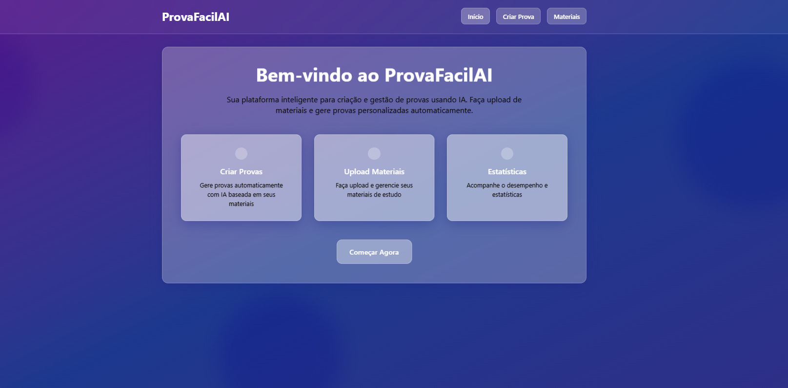
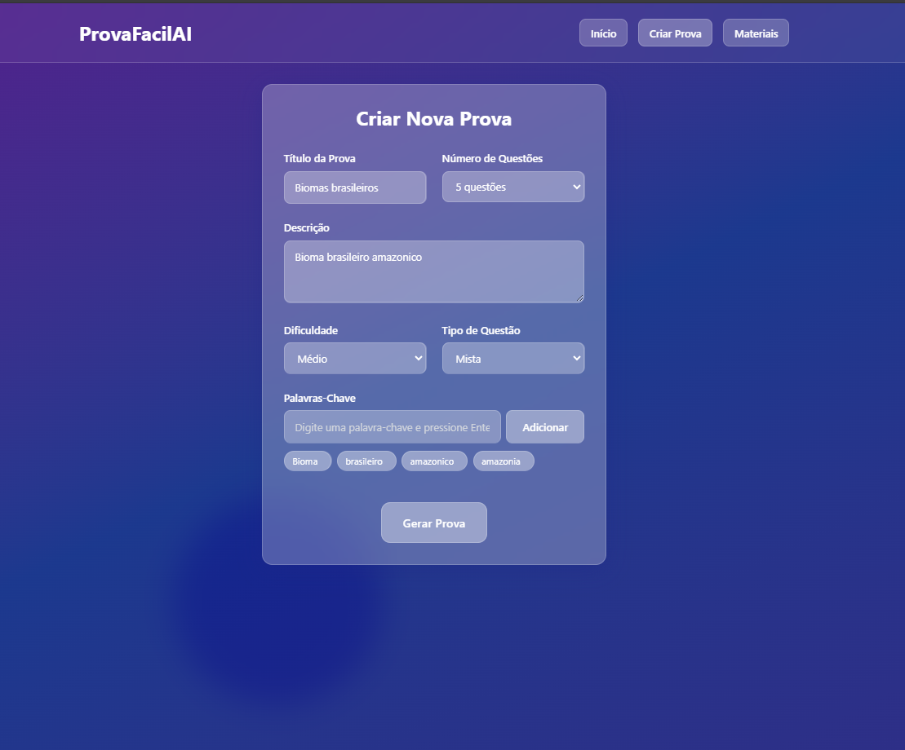
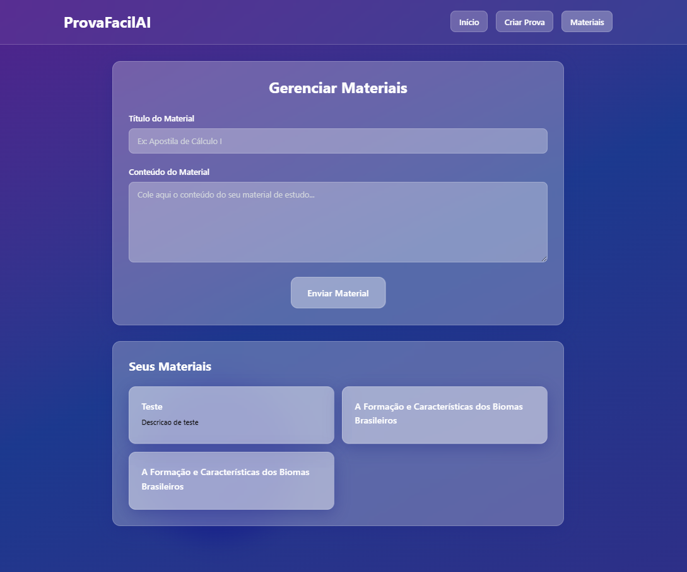

# ProvaFacilAI

Um sistema inteligente de geração de provas usando RAG (Retrieval-Augmented Generation) com Spring Boot e Nuxt.js.

## 📋 Sobre o Projeto

O ProvaFacilAI é uma aplicação que permite fazer upload de materiais de estudo e gerar provas personalizadas automaticamente usando inteligência artificial. O sistema utiliza tecnologias de busca semântica e geração de texto para criar questões relevantes baseadas no conteúdo fornecido.

## 🏗️ Arquitetura

- **Backend**: Spring Boot 3.5.5 com Java 21
- **Frontend**: Nuxt.js 4 com Vue 3 e Tailwind CSS 4
- **Banco de Dados**: PostgreSQL com extensão pgvector
- **IA**: Ollama com modelos Qwen para chat e tradução
- **Busca Semântica**: Spring AI Vector Store

## 📱 Funcionalidades

### Página Principal


### Criar Provas

*Interface para configuração e geração de provas personalizadas*

### Upload de Materiais

*Sistema de upload e organização de materiais de estudo*

### Estatísticas
🚧 **Coming Soon** - Painel de estatísticas e analytics

## 🚀 Como Executar

### Pré-requisitos

- Java 21+
- Node.js 18+
- Docker e Docker Compose
- Git

### 1. Clonar o Repositório

```bash
git clone <url-do-repositorio>
cd ProvaFacilAI
```

### 2. Iniciar Serviços Docker

```bash
docker-compose up -d
```

### 3. Executar o Backend

```bash
./mvnw spring-boot:run
```

### 4. Executar o Frontend

```bash
cd ui/nuxt-app
npm install
npm run dev
```

### 5. Acessar a Aplicação

- Frontend: http://localhost:3000
- Backend API: http://localhost:8080
- Swagger UI: http://localhost:8080/swagger-ui.html

## 🛠️ Tecnologias Utilizadas

### Backend
- Spring Boot 3.5.5
- Spring AI 1.0.1
- PostgreSQL com pgvector
- Hibernate Vector
- Apache Tika
- Springdoc OpenAPI

### Frontend
- Nuxt.js 4
- Vue.js 3
- Tailwind CSS 4
- TypeScript

### IA e Machine Learning
- Ollama
- Modelos Qwen para chat e tradução
- Nomic Embed Text para embeddings

## 📚 API Endpoints

### Provas
- `POST /api/provas/gerar` - Gerar nova prova
- `GET /api/provas/minhas-provas` - Listar provas do usuário
- `GET /api/provas/{id}` - Obter prova específica

### Materiais
- `POST /api/materiais/upload` - Upload de material
- `GET /api/materiais` - Listar materiais
- `DELETE /api/materiais/{id}` - Remover material

## 🔧 Configuração

### Banco de Dados
```properties
spring.datasource.url=jdbc:postgresql://localhost:5432/postgres
spring.datasource.username=postgres
spring.datasource.password=postgres
```

### Ollama
```properties
ollama.api.base-url=http://localhost:11434/api/generate
ollama.api.model-chat=qwen:latest
ollama.api.model-translate=lauchacarro/qwen2.5-translator:latest
ollama.api.model-embed=nomic-embed-text:latest
```

## 📖 Como Usar

1. **Upload de Materiais**: Faça upload dos seus materiais de estudo na seção "Materiais"
2. **Configurar Prova**: Vá para "Criar Prova" e configure os parâmetros desejados
3. **Gerar Prova**: O sistema criará questões baseadas nos materiais carregados
4. **Visualizar Resultado**: Visualize e exporte sua prova gerada

## 🤝 Contribuição

1. Fork o projeto
2. Crie uma branch para sua feature (`git checkout -b feature/AmazingFeature`)
3. Commit suas mudanças (`git commit -m 'Add some AmazingFeature'`)
4. Push para a branch (`git push origin feature/AmazingFeature`)
5. Abra um Pull Request

## 📄 Licença

Este projeto está sob licença MIT. Veja o arquivo `LICENSE` para mais detalhes.